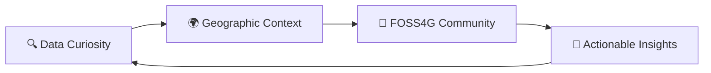

<div align="center">
  
# 👋 Hey there, I'm Hemed Lungo


### 🛰️ Geospatial Analyst • 🧠 Data Wrangler • 🌍 FOSS Advocate

[](https://twitter.com/725Hemeed)
[](mailto:hemedlungo@gmail.com)

</div>

---

## 🎯 What I'm Up To

```python
current_focus = {
    "🛰️ Climate Viz": "Building climate and land cover visualizations in QGIS & Google Earth Engine",
    "🔬 Data Processing": "Analyzing MODIS, Sentinel-2, and TerraClimate datasets",
    "🐍 QGIS Extension": "Developing custom Python and R scripts for spatial workflows",
    "📦 Open Source": "Contributing to R & Python spatial data science ecosystem"
}
```

---

## 🚀 Featured Projects

<table>
<tr>
<td width="50%">

### 🔗 [ClimateR demo with TerraClimate](https://github.com/Heed725/Terraclimate-ClimateR-Tutorial)
A reproducible workflow to access, process, and visualize TerraClimate datasets using the `climateR` and `tidyterra` packages.

**Tech Stack:** R • tidyterra • climateR

</td>
<td width="50%">

### 🧩 [QGIS Color Ramp Generator](https://github.com/Heed725/qgis-color-ramp-generator-plugin)
Generate beautiful and consistent color ramps for maps in QGIS. Inspired by `MetBrewer` and `MoMAColors`.

**Tech Stack:** Python • QGIS • PyQt

</td>
</tr>
<tr>
<td width="50%">

### 🗺️ [Tanzania MODIS Projects](https://github.com/Heed725/Tanzania-Modis-Classification-Map)
Extraction and processing scripts for MODIS Landcover data across Tanzania. Supports environmental change detection workflows.

**Tech Stack:** R • MODIS • Google Earth Engine

</td>
<td width="50%">

### 🌐 More Projects Coming Soon...
Currently working on spatial analysis tools and climate data visualizations. Stay tuned!

</td>
</tr>
</table>

---

## 🛠️ Skills & Toolbox

<div align="center">

### 💻 Languages & Frameworks


### 🗺️ Geospatial & GIS Tools


### 📊 Data Science & Analysis


### 🧰 Key R Packages
`terra` • `sf` • `ggplot2` • `dplyr` • `climateR` • `openair` • `tidyterra` • `stars` • `rayshader`

### ⚡ Dev Tools


</div>

---

## 💡 My Approach

<div align="center">



</div>

> 🧪 Driven by data curiosity & geographic context  
> 🤝 Supporting and building with the FOSS4G and OSM communities  
> 🌱 Always learning, always growing

---

## 🤝 Let's Connect

<div align="center">

[](mailto:hemedlungo@gmail.com)
[](https://twitter.com/725Hemeed)
[](https://github.com/Heed725)

</div>

---

<div align="center">
  
### 💭 Quote of the Day
  


</div>

---

<div align="center">
  
</div>

<div align="center">
  <sub>✨ GIF Credit: Walter Newton | Built with ❤️ using Markdown</sub>
</div>
